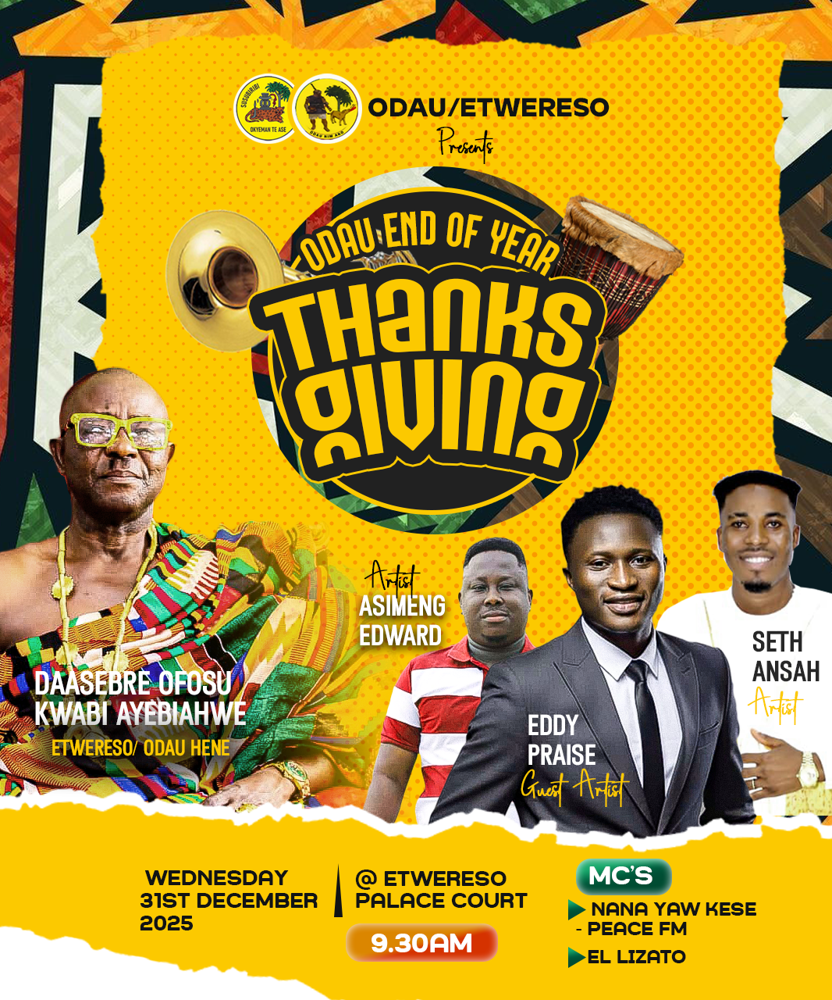

# RICHARD-BOSOMPEM-2425400373
Portfolio website project for FOUNDATIONS OF MULTIMEDIA AND WEB DESIGN (IT 245)
NAME:	RICHARD BOSOMPEM
INDEX NUMBER:	2425400373
COURSE CODE: 	IT 245
COURSE TITLE: 	FOUNDATIONS OF MULTIMEDIA AND WEB DESIGN 
PROGRAMME: 	BSc. INFORMATION TECHNOLOGY (Weekend)
LEVEL:	200
SEMESTER:	ONE
LECTURER:  MR. EBENEZER AKAGLO
DATE OF SUBMISSION:  31ST  DECEMBER 2025

ASSIGNMENT: Portfolio Website using html and CSS (Design Process)
Contents
1.	Introduction	3
2.	Abstract	4
3.	Project Planning	4
3.1 Project Objectives	4
3.2 Scope of the Project	4
3.3 Tools and Technologies	4
3.4 Project Schedule	5
3.5 Expected Outcomes	5
4.	Tools and Technologies	5
4.1 HTML5	5
4.2 CSS3	5
4.3 VS CODE	5
4.4 GitHub	5
5. Website Structure and Layout	5
5.1 Page Hierarchy	5
5.2 Navigation System	6
5.3 Site Map	6
6. Homepage Development	6
6.1 Header and Logo	6
6.2 Hero section (welcome text and main introduction)	6
6.2 Buttons for navigation to About,Skills, and Contact pages	7
7. Footer	8
8. Secondary Pages development	9
8.1 About page	9
8.2 Skills Page	10
8.3 Gallery Page	12
8.4 Contact Page	13
9. Multimedia Integration	14
9.1 Images placed in the images folder	14
8.1 Button styled via CSS and Gallery uses; target pseudo-class for lightbox functionality	15
10. CSS Styling and Formatting	16
10.1 Fonts and Headings	16
10.2 Colors and Layout	17
11. Hosting on GitHub	21
11.1 Repository Setup	21
11.2 Pushing Code	21
12. Testing and Validation	21
13. Challenges and Solutions	22
14. Conclusion	22
15. References	23

1.	Introduction
Information and Communication Technology's (ICT) fast expansion has made digital platforms an absolute necessity in contemporary education and professional growth. A personal website is among the most efficient means to build an online identity. This project shows fundamental web development skills and personal branding by designing and building a personal website utilizing HTML and CSS. 
The goal of the website is to present personal skills, academic background, finished projects, and contact information in an organized and easily readable format. The website offers lecturers, possible employers, and other parties a digital portfolio that makes it simple to evaluate the developer's skills and accomplishments. 
Having a web presence is becoming more and more crucial in contemporary education and job development. While employers use internet sites to assess applicants' professional and technical abilities, educational institutions stress useful digital skills. Visibility, self-presentation, and competitive edge in the job market are all improved with a personal website. 
Five primary pages ; Home, About, Gallery, Skills, and Contact make up the website. Every page serves a particular purpose to guarantee simple browsing and clear communication of information to customers. 
All things considered, this endeavor shows how internet development ideas are used in practice and stresses the need of keeping a professional internet presence in the current digital landscape.

2.	Abstract
From preparation to styling, development, testing, and hosting, this report thoroughly describes the evolution of my own website. There are five pages on the website: Home, About, Skills, Gallery, and Contact. All pages have CSS styling, include multimedia components, and are linked. Hosted on GitHub, the website is built to be approachable and responsive. Furthermore, included in this study are instructional materials, charts, and screen captures to help to explain the procedure.

3.	Project Planning
One of the most important steps in website creation is project planning because it guarantees that the finished result satisfies the target goals within the limited time and resources. Identifying the website objectives, deciding requirements, choosing development tools, and arranging the general process defined this stage.
3.1 Project Objectives
The main objective of the project was to design and develop a functional personal website using HTML and CSS. Specific objectives included:
•	Showcasing personal skills, academic background, and projects
•	Demonstrating practical knowledge of basic web development technologies
•	Creating a simple, user-friendly, and well-structured website
•	Providing accessible contact information for communication
3.2 Scope of the Project
Five pages; Home, About, Skills, Gallery, and Contact limited the scope of the project to the design and development of a static website. Using HTML and CSS, the website highlights content presentation, navigation, and visual design devoid of server-side scripting or databases.
3.3 Tools and Technologies
Common web development tools and methods were used to create the website. While CSS was employed for styling and layout, HTML was used to organize the web pages. Coding was done with a VS Code editor; testing and previewing the website over many screen sizes was done with a chrome web browser.
3.4 Project Schedule
Including planning, design, development, testing, and ultimate deployment, the project was carried out in stages. Every step was finished within a given time frame to guarantee consistent development and quick completion of the website.
3.5 Expected Outcomes
A completely operating personal website was anticipated at the conclusion of the project to show good page construction, consistent styling, simple navigation, and clear data presentation. The finished website acts as a professional digital portfolio in addition to an academic assignment.

4.	Tools and Technologies
4.1 HTML5
•	Used for page structure
•	Semantic tags like <header>, <nav>, <section>, <footer>, <figure>
4.2 CSS3
•	Used for styling: fonts, colors, layout, spacing, hover effects
4.3 VS CODE
•	Development environment
•	Code view (no WYSIWYG)
4.4 GitHub
•	Repository creation, version control, and hosting via GitHub Pages

5. Website Structure and Layout
5.1 Page Hierarchy
•	Homepage: central hub
•	Secondary pages: About, Skills, Gallery, Contact
5.2 Navigation System
•	Navigation bar with left-aligned, bold links
•	Buttons linking to Skills, Gallery, and Contact pages
5.3 Site Map
•	Figure 1.1: The overall structure and navigation flow of the website 

6. Homepage Development
6.1 Header and Logo
•	Logo added using html code 
And CSS; width: 120px;
height: auto;
display: block;
margin: 0px auto;
•	Figure 1.2 The header section of the homepage and navigation menu is shown 
 
6.2 Hero section (welcome text and main introduction)
•	

•	     
•	  <h3>Hi! Welcome</h3>
•	  <h1>Richard Bosompem</h1>
•	  
Senior Chief Executive Manager of On God Concept Creatives

•	
•	  <a href="about.html" class="btn">About Me</a>
•	

6.2 Buttons for navigation to About,Skills, and Contact pages

•	Buttons displayed for html and CSS respectively;
•	<a href="about.html" class="btn">About Me</a>
•	<a href="skills.html" class="skills-btn">My Skills</a>
•	<a href="gallery.html" class="gallery-btn">View Gallery</a>
•	<a href="contact.html" class="contact-btn">Contact Me</a>

•	CSS styling for fonts, size, and spacing Respectively
       }
.btn {   /* about button*/
  display: inline-block;
  padding: 10px 20px;
  background-color: #007BFF;
  color: white;
  text-decoration: none;
  border-radius: 5px;
  font-weight: bold;
  margin-top: 1px;
}

skills-btn { /* skill button*/
  display: inline-block;
  padding: 10px 20px;
  background-color: red;
  color: white;
  text-decoration: none;
  font-weight: bold;
  border-radius: 5px;
  margin-top: 5px;
  margin-left: 19px;
  margin-bottom: 15px;
}

.gallery-btn { /* gallery button*/
  display: inline-block;
  padding: 10px 20px;
  background-color: green;
  color: white;
  text-decoration: none;
  font-weight: bold;
  border-radius: 5px;
  margin-top: 10px;
  margin-left: 19px;
  margin-bottom: 15px;
}

.contact-btn:hover {
  background-color: darkorange;
7. Footer
Copy right html code below;
<footer>
  &copy; OG Concept@2026 
</footer>

</body>
</html>
CSS Code below;
footer {
  background: #00499c;
  color: white;
  text-align: center;
  padding: 10px;

8. Secondary Pages development
8.1 About page
<!DOCTYPE html>
<html>
<head>
  <title>About Me</title>
  <link rel="stylesheet" href="style.css">
</head>
<body>

<nav>
  <a href="index.html">Home</a>
  <a href="about.html">About</a>
  <a href="skills.html">Skills</a>
  <a href="gallery.html">Gallery</a>
  <a href="contact.html">Contact</a>
</nav>

  <h1>About Me</h1>
  

I’m the man behind OG Concept.  To me, "OG" isn't just a name; it’s about being Original and staying Grounded. 
My professional life is a balancing act between two worlds. As a Correction Officer, I operate in a world of rules, security, and routine.  As a Graphic Designer, I operate in a world of color, imagination, and breaking boundaries. 
I started OG Concept to prove that you don't have to choose between being hardworking and being creative.  I bring the grit and dedication from my day job into every design I create. I understand that in both the facility and the marketplace,  your reputation depends on how you present yourself.
I’m here to make sure your brand looks sharp, stands tall, and commands respect.

<a href="skills.html" class="skills-btn">My Skills</a>

<footer>
  &copy; OG Concept@2026
</footer>

</body>
</html>

8.2 Skills Page
<!DOCTYPE html>
<html>
<head>
  <title>My Skills</title>
  <link rel="stylesheet" href="style.css">
</head>
<body>

<nav>
  <a href="index.html">Home</a>
  <a href="about.html">About</a>
  <a href="skills.html">Skills</a>
  <a href="gallery.html">Gallery</a>
  <a href="contact.html">Contact</a>
</nav>

  <h1>My Skills</h1>
  <ul>
    <li>Microsoft office suite</li>
    <li>Photoshop</li>
    <li>Basic Computer Networking</li>
    <li>Problem Solving</li>
  </ul>

<a href="gallery.html" class="gallery-btn">View Gallery</a>

<footer>
  &copy;  OG Concept@2026
</footer>

</body>
</html>

8.3 Gallery Page
<!DOCTYPE html>
<html>
<head>
  <title>Gallery</title>
  <link rel="stylesheet" href="style.css">
</head>
<body>

<nav>
  <a href="index.html">Home</a>
  <a href="about.html">About</a>
  <a href="skills.html">Skills</a>
  <a href="gallery.html">Gallery</a>
  <a href="contact.html">Contact</a>
</nav>

     
  <h1>Gallery</h1>
  
Below are sample images related to my work.

  
 
     
    
    
 

<a href="contact.html" class="contact-btn">Contact Me</a>

<footer>
  &copy; OG Concept@2026
</footer>

</body>
</html>

8.4 Contact Page
<!DOCTYPE html>
<html>
<head>
  <title>Contact Me</title>
  <link rel="stylesheet" href="style.css">
</head>
<body>

<nav>
  <a href="index.html">Home</a>
  <a href="about.html">About</a>
  <a href="skills.html">Skills</a>
  <a href="gallery.html">Gallery</a>
  <a href="contact.html">Contact</a>
</nav>

  <h1>Contact Me</h1>
  
Email: richardbosompem14@gmail.com

  
Phone: +233240506886/0206522641

<footer>
  &copy; OG Concept@2026
</footer>

</body>
</html>
9. Multimedia Integration 
9.1 Images placed in the images folder

    

 
 
     
    
    

/* Gallery images */
.gallery img {
  width: 150px; /* size of image */
  margin: 10px;
  border-radius: 5px;
  transition: transform 0.3s;
  cursor: pointer;
}

8.1 Button styled via CSS and Gallery uses; target pseudo-class for lightbox functionality

.gallery img:hover {
  transform: scale(1.1); /* hover zoom effect */
}

/* Lightbox overlay */
.lightbox {
  display: none;
  position: fixed;
  z-index: 999;
  padding-top: 60px;
  left: 0;
  top: 0;
  width: 100%;
  height: 100%;
  overflow: auto;
  background-color: rgba(0,0,0,0.9);
}

.lightbox:target {
  display: block;
  text-align: center;
}

.lightbox img {
  max-width: 80%;
  max-height: 80%;
  margin: auto;
  border-radius: 5px;
}

.gallery {  /* gallery images */
  display: flex;            /* makes children align horizontally */
  flex-wrap: wrap;          /* allows images to move to next line if screen is small */
  justify-content: center;  /* centers images horizontally */
  gap: 15px;                /* space between images */
  margin-left: -650px;
}

.gallery-img {  /* gallery images */
  width: 150px;             /* adjust image size */
  height: auto;             /* keeps aspect ratio */
  border-radius: 5px;       /* optional rounded corners */

}

10. CSS Styling and Formatting
10.1 Fonts and Headings
•	Headings: size 14, Times New Roman, bold, left-aligned
•	Paragraph text: size 12, Times New Roman, justified, line-height 1.5
10.2 Colors and Layout
body {
  font-family: 'Times New Roman', Times, sans-serif;
  font-size: 12px;
  margin-left: 2.5;
  margin-top: 2;
  margin-bottom: 2;
  margin-right: 2;
  background-color: #f2f2f2;
}

nav {
  background: #00499c;
  padding: 10px;
  text-align: left;
  font-weight: bold;
}

nav a {
  color: white;
  margin: 10px;
  text-decoration: none;
  font-weight: bold;
  
}

.container {
  background: white;
  padding: 20px;
  margin: 20px;
}

footer {
  background: #00499c;
  color: white;
  text-align: center;
  padding: 10px;
}
.btn {   /* about btton*/
  display: inline-block;
  padding: 10px 20px;
  background-color: #007BFF;
  color: white;
  text-decoration: none;
  border-radius: 5px;
  font-weight: bold;
  margin-top: 1px;
}

.btn:hover {
  background-color: #0056b3;
}
h1,h2,h3,h4,h5 {
  font-family: "Times New Roman";
  font-size: 14px;
  font-weight: bold;
  text-align: left;
}
skills-btn {
  display: inline-block;
  padding: 10px 20px;
  background-color: red;
  color: white;
  text-decoration: none;
  font-weight: bold;
  border-radius: 5px;
  margin-top: 5px;
  margin-left: 19px;
  margin-bottom: 15px;
}

.skills-btn:hover {
  background-color: darkred;
}

.gallery-btn {
  display: inline-block;
  padding: 10px 20px;
  background-color: green;
  color: white;
  text-decoration: none;
  font-weight: bold;
  border-radius: 5px;
  margin-top: 10px;
  margin-left: 19px;
  margin-bottom: 15px;
}

.gallery-btn:hover {
  background-color: darkgreen;
}

.contact-btn {
  display: inline-block;
  padding: 10px 20px;
  background-color: orange;
  color: white;
  text-decoration: none;
  font-weight: bold;
  border-radius: 5px;
  margin-top: 10px;
  margin-left: 3px;
  margin-bottom: 15px;
}

.contact-btn:hover {
  background-color: darkorange;
}

/* Lightbox overlay */
.lightbox {
  display: none;
  position: fixed;
  z-index: 999;
  padding-top: 60px;
  left: 0;
  top: 0;
  width: 100%;
  height: 100%;
  overflow: auto;
  background-color: rgba(0,0,0,0.9);
}

11. Hosting on GitHub 

11.1 Repository Setup
•	Create a public repository
•	Upload all HTML, CSS, and images
11.2 Pushing Code
•	Use Git commands in VS Code: git add., git commit, git push
11.3 Enabling GitHub Pages
•	Settings → Pages → Select main branch → Website URL generated
12. Testing and Validation 
Testing and validation were conducted to make sure the project goals are satisfied and the personal website runs as intended. During and after creation, the website was tested to spot and fix mistakes with layout, navigation, and content display. 
To ensure that all navigational links direct users to the appropriate pages, functional testing was undertaken. Every page was opened to make sure the images, text, and other components were presented correctly without distortion or distortion. 
Viewing the website in several web browsers, including Google Chrome and Microsoft Edge, also carried out compatibility testing. This guaranteed uniformity of appearance and performance in several browsers. Additionally, basic response testing was conducted by changing the size of the browser window to make sure the format fits many screen sizes. 
To guarantee conformance with web standards, the HTML and CSS were validated. Errors found during testing were fixed to increase the general usability and dependability of the website. 
All things considered, the testing and validation procedure confirmed that the website is user-friendly, suitable for professional and academic usage, and operational.

13. Challenges and Solutions
There were many obstacles faced as the personal website was built. These difficulties offered insightful learning opportunities and were solved by means of suitable solutions. 
One of the main difficulties encountered was getting page elements especially the logo and navigation menu to show appropriately across several screen sizes. Employing CSS layout methods like the flexbox model, which guaranteed correct alignment and uniformity, helped to solve this problem. 
Managing picture sizes and placement on the Projects/Gallery page presented another difficulty. Due to uneven sizes, some photographs looked distorted or out of line. Resizing images suitably and adding uniform CSS style to keep a uniform appearance helped to solve this issue. 
Linking several pages presented difficulties as well, mostly in guaranteeing that navigation links functioned properly throughout all pages. Making sure proper linking required thorough checking of folder structure, file names, and relative paths. 
Initially challenging as well was keeping a uniform design across every page. By utilizing a single external CSS file for styling, which guaranteed consistent design, colors, and type throughout the website, this challenge was addressed. 
Finally, astute testing, use of suitable web development methods, and constant website review throughout development successfully handled these issues.

14. Conclusion
The personal website's creation successfully satisfied the project's goals. Simple, well-organized, user-friendly platform for displaying personal talents, academic background, projects, and contact details was developed and executed using HTML and CSS. 
This project provided a successful use of hands-on understanding of web development ideas including page structure, navigation, layout design, and styling. The website shows how crucial it is to keep a professional online presence in contemporary schooling and professional growth. 
Testing and validation verified that the website runs appropriately across several browsers and pages; identified problems were fixed with suitable remedies. All things considered, the project gave useful practical experience and acts as a solid base for future upgrades and more sophisticated web creation.

15. References
Duckett, J. (2011). HTML and CSS: Design and build websites. John Wiley & Sons.
Flanagan, D. (2018). JavaScript: The definitive guide (7th ed.). O’Reilly Media.
Mozilla Developer Network. (n.d.). HTML: HyperText Markup Language. Retrieved from https://developer.mozilla.org
Mozilla Developer Network. (n.d.). CSS: Cascading Style Sheets. Retrieved from https://developer.mozilla.org
W3C. (n.d.). HTML & CSS standards. World Wide Web Consortium. Retrieved from https://www.w3.org

